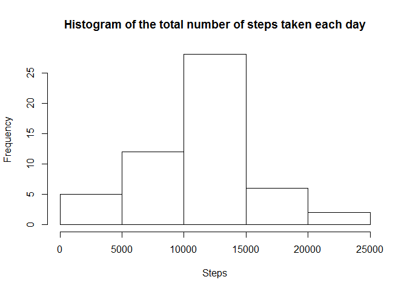
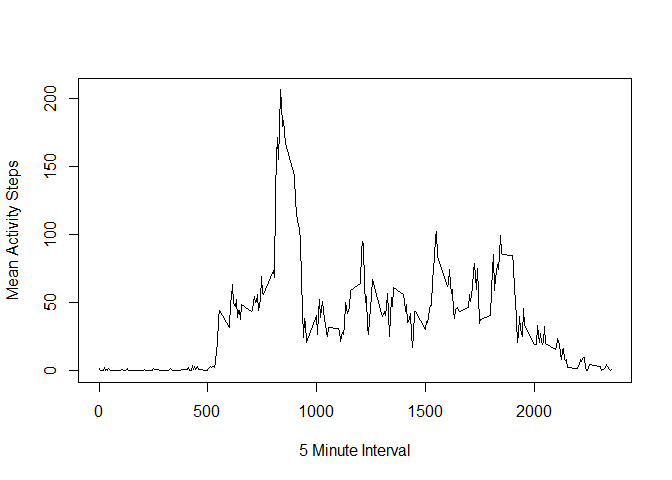
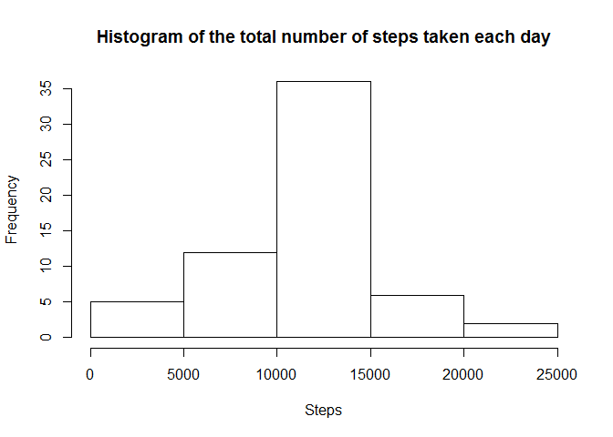

# Reproducible Research: Peer Assessment 1


## Loading and preprocessing the data

```r
activity <- read.table("activity.csv", header=TRUE, sep=",")
activity$date <- as.Date(activity$date,format="%Y-%m-%d")
```
## What is mean total number of steps taken per day?


```r
agg_steps <- aggregate(steps ~ date, activity, sum,na.rm=T)
hist(agg_steps$steps, main="Histogram of the total number of steps taken each day", xlab="Steps")
```

 

```r
mean <- mean(agg_steps$steps)
median <- median(agg_steps$steps)
```
Mean value of total number of steps is 1.0766189\times 10^{4}

Median value of total number of steps is 10765

## What is the average daily activity pattern?

```r
agg_interval <- aggregate(activity$steps,list(interval=activity$interval), mean, na.rm=T)

with(agg_interval, plot(interval, x, xlab="5 Minute Interval", ylab="Mean Activity Steps", pch=5, type="l"))
```

 

## Imputing missing values

```r
missing_length <- length(which(is.na(activity$steps)==T))

for(idx in 1:length(activity$steps)){
  if(is.na(activity$steps[idx])){
    activity$steps[idx] = agg_interval[which(agg_interval$interval==activity$interval[idx]),2]
  }
}

agg_steps_fd <- aggregate(steps ~ date, activity, sum,na.rm=T)
hist(agg_steps_fd$steps, main="Histogram of the total number of steps taken each day", xlab="Steps")
```

 

```r
mean_fd <- mean(agg_steps_fd$steps)
median_fd <- median(agg_steps_fd$steps)
```

Total number of missing values in the dataset: 2304

Mean value of total number of steps is 1.0766189\times 10^{4}

Median value of total number of steps is 1.0766189\times 10^{4}

## Are there differences in activity patterns between weekdays and weekends?


```r
activity$dayType = weekdays(activity$date, abbreviate=TRUE)

isWeekDay <- function(day){
  weekdays <- c("Mon", "Tue", "Wed", "Thu", "Fri")
  
  
  if(day %in% weekdays){
     isWeek <- "weekday"
  }else{
    isWeek <- "weekend"  
  }
  
  isWeek
}

activity$weekDay <- sapply(activity$dayType,isWeekDay)

agg_interval_week <- aggregate(activity$steps,list(interval=activity$interval, 
                               weekday=activity$weekDay), mean, na.rm=T)

agg_interval_week <- transform(agg_interval_week, weekday = factor(weekday))

library(lattice)
xyplot(x ~ interval | weekday, data=agg_interval_week, layout=c(1,2), xlab="Interval",
       ylab="Number of Steps", type="l")
```

 
